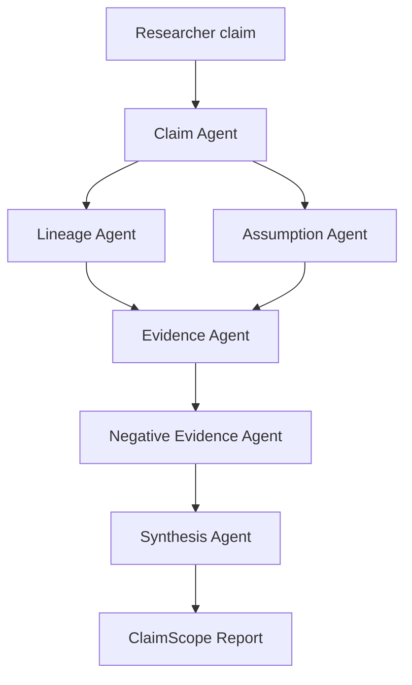

# ClaimScope

ClaimScope is a pre-ideation research assistant for mapping what must be known
before a new idea is formed.

It does not try to be an autonomous scientist or a generic literature-review
bot. Given a fuzzy research direction or claim, it builds a structured map of:

- claim variants and boundary conditions
- hidden assumptions behind the claim
- evidence for each assumption
- targeted support / contradiction / limitation / null-result queries for each
  assumption
- limitations, failure modes, and negative results
- concrete idea opportunities that can become small experiments

Example input:

```text
RAG can reliably reduce hallucination in LLM-generated answers
```

Example output:

- the claim variant that only holds under retrieval-quality conditions
- assumptions about evidence relevance, metrics, and generalization
- papers that support or limit each assumption
- the per-assumption query matrix used to find support, contradiction,
  limitation, and null-result evidence
- negative evidence such as retrieval noise or citation mismatch
- small experiment slots for future research

## Why This Is Different

Many tools already retrieve papers, summarize literature, or generate research
ideas. ClaimScope focuses on the stage before idea generation:

```text
fuzzy research direction
-> extract core claim
-> map claim variants
-> decompose hidden assumptions
-> check assumption evidence
-> mine negative evidence and limitations
-> synthesize research opportunity slots
```

The contribution is not "another paper search assistant." The contribution is a
traceable pre-ideation workflow that helps researchers see which statements are
already validated, which assumptions are still weak, and which failure modes are
worth turning into new experiments.

## Agent Roles



| Agent | Responsibility |
|---|---|
| Claim Agent | Normalize the user input and generate claim variants |
| Lineage Agent | Surface how the claim changes under conditions and failures |
| Assumption Agent | Decompose the claim into testable hidden assumptions |
| Evidence Agent | Build per-assumption support, contradiction, limitation, and null-result queries |
| Negative Evidence Agent | Mine limitations, failures, null results, and risks |
| Synthesis Agent | Convert gaps and failures into research opportunity slots |

## Quick Start

Install dependencies:

```powershell
python -m pip install -r requirements.txt
```

Run the Streamlit app:

```powershell
streamlit run app.py
```

Run the CLI in deterministic demo mode:

```powershell
python -m claimscope.cli "RAG can reliably reduce hallucination in LLM-generated answers"
```

Use online academic search:

```powershell
python -m claimscope.cli "RAG can reliably reduce hallucination in LLM-generated answers" --online
```

Use the LLM planner for domain-specific claim variants and assumption queries:

```powershell
python -m claimscope.cli "Diffusion models improve MRI tumor segmentation with limited labels" --online --planner llm
```

Online mode uses public arXiv and Semantic Scholar APIs. A Semantic Scholar API
key is optional and only raises rate limits.

## API Keys

Do not commit keys. Put local credentials in environment variables:

```powershell
$env:OPENAI_BASE_URL="your-openai-compatible-base-url"
$env:OPENAI_API_KEY="your-key"
$env:MODEL_NAME="your-model"
```

Run the ClaimScope MCP server over stdio for an MCP client:

```powershell
python -m claimscope.mcp_server
```

The server uses the same environment variables above for optional LLM planning;
offline demo tools work without a key.

The core pipeline runs without an LLM key through the deterministic heuristic
planner. When the environment variables above are present, the LLM planner can
turn fuzzy research directions into domain-specific claim variants, hidden
assumptions, and support / contradiction / limitation / null-result queries.
Selecting the LLM planner sends the input direction to your configured endpoint.
If the LLM call fails or the response is invalid, ClaimScope reports the fallback
and uses the heuristic planner.

## Verification

Run:

```powershell
python -m pytest -q
```

Current tests cover the core pre-ideation pipeline:

- mapping assumptions to traceable evidence
- using an optional LLM planner with heuristic fallback
- mining negative evidence
- generating actionable idea opportunities
- exporting a Markdown report with the required sections
