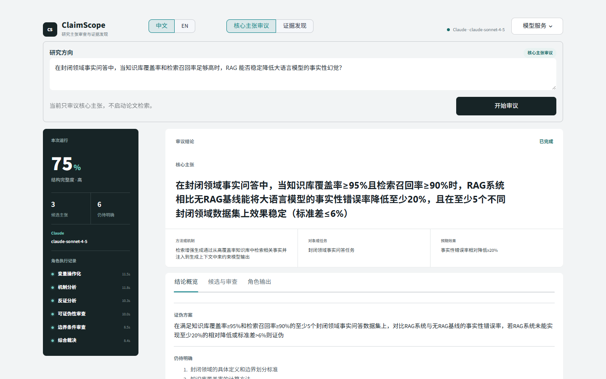
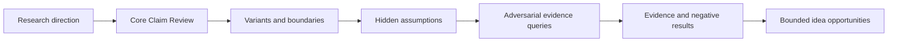

# ClaimScope

[](https://github.com/yueqian-coder/multi/actions/workflows/ci.yml)
[](https://www.python.org/)
[](LICENSE)
[](docs/architecture.md)

ClaimScope turns a fuzzy research direction into a falsifiable claim, an assumption ledger, adversarial evidence queries, and bounded experiment opportunities before you commit to an idea.

> Open-source pre-ideation research tooling: adversarial by design, evidence-first, and explicit about uncertainty.



## 30-second Quick Start

```bash
python -m pip install -e ".[web,dev]"
python -m claimscope.cli "RAG can reliably reduce hallucination in LLM-generated answers"
streamlit run app.py
```

The CLI command is a deterministic offline baseline. The Web app is the strict-agent surface: choose the GPT, Claude, or custom provider profile, approve remote processing, and run all six roles. It never substitutes a heuristic result when a Web agent stage fails.

## Core Claim Review

Core Claim Review runs three proposers, two adversarial critics, and one judge. During execution the bilingual UI streams `Proposer -> Critic -> Judge` status. Afterward, the workbench exposes a claim anatomy, candidate comparison, six-axis reviews, revision notes, and public role outputs. These are structured public artifacts, not private chain-of-thought. The score measures claim completeness, not epistemic confidence.

## Full Assumption / Evidence Workflow

1. Normalize the direction into a core claim and boundary variants.
2. Decompose the claim into hidden, testable assumptions.
3. Generate support, contradiction, limitation, and null-result queries for each assumption.
4. Retrieve papers, map abstract snippets to assumptions, and keep `unknown` distinct from a direct contradiction signal.
5. Surface negative evidence, failure modes, quality warnings, and experiment-sized opportunity slots.
6. Export a Markdown report with workflow trace, provenance, evidence matrix, and limitations.

## ClaimBench

ClaimBench is a deterministic, no-network smoke benchmark with 27 cross-domain cases. It scores slot coverage, specificity, comparison language, measurable outcomes, falsification quality, and overclaim penalties.

```bash
python -m claimscope.cli benchmark --engine heuristic
```

The current heuristic baseline scores `70.09/100` across 27 internal smoke cases. This is a regression signal, not a claim of scientific validity or general agent quality.

## MCP

```bash
python -m pip install -e ".[mcp]"
python -m claimscope.mcp_server
```

The five tools are `extract_core_claim`, `analyze_research_direction`, `build_evidence_queries`, `evaluate_claim_benchmark`, and `get_demo_report`. Optional LLM configuration uses placeholders only: `OPENAI_BASE_URL`, `CLAIMSCOPE_GPT_API_KEY`, `CLAIMSCOPE_CLAUDE_API_KEY`, and provider-specific model variables. Keys are read from environment variables or an in-memory UI field and are never written to reports.

The UI requires explicit consent before sending research directions to a configured LLM provider or generated search queries to public academic APIs. Full Discovery in the Web app always uses live academic retrieval; there is no synthetic Web result path. CLI and MCP users opt in by configuring environment variables or setting `online=true`; do not submit confidential research text to providers you do not trust.

Safely check model availability without putting a key in shell history:

```bash
python scripts/probe_provider.py --list-models
```

Minimal MCP client configuration after installation:

```json
{
  "mcpServers": {
    "claimscope": {
      "command": "claimscope-mcp"
    }
  }
}
```

## Architecture



`claimscope.models` defines typed artifacts. `core_claim` and `planner` create claims; `pipeline` coordinates the assumption/evidence workflow; `retrievers` provide offline fixtures or optional public sources; `service` provides JSON-compatible boundaries; `cli`, Streamlit, and `mcp_server` are transports. Public trace events contain role, status, duration, artifacts, and scores, not private reasoning.

Detailed diagrams, module contracts, and failure behavior are documented in [System Architecture](docs/architecture.md). The course-oriented experiment record is available in [Experiment Report](docs/course-report.md), with a reproducible [60-second demo script](docs/demo-script.md).

## Review Artifacts

- [Editable course report](deliverables/ClaimScope-course-report.docx)
- [Rendered course report](deliverables/ClaimScope-course-report.pdf)
- [Manual 60-second recording guide](docs/demo-script.md)

The report contains the student identity provided for the course submission. The final submission copies use the required Chinese filename.

## Project Skills

Install the pinned [MiniMax skills collection](https://github.com/MiniMax-AI/skills) and [UI/UX Pro Max](https://github.com/nextlevelbuilder/ui-ux-pro-max-skill) into this project with:

```powershell
powershell -ExecutionPolicy Bypass -File scripts/install-skills.ps1
```

Third-party files stay local under `.codex/`; the reproducible installer and generated [ClaimScope design system](design-system/claimscope/MASTER.md) are versioned.

## Limitations

- Bundled papers are synthetic fixtures, not research findings.
- Online retrieval is abstract/snippet-oriented and is not a substitute for full papers.
- Evidence labels are heuristic abstract-match signals, not verified scientific support or disproof.
- Heuristic scores are transparent signals, not scientific validity judgments.
- Strict Web agent runs depend on a configured endpoint and fail visibly instead of degrading to heuristics.
- CLI and MCP retain explicit heuristic modes for offline regression and testing.
- ClaimBench is a smoke benchmark, not a claim of general research-agent quality.

## Roadmap

- Add opt-in full-text connectors with stronger provenance and license-aware caching.
- Expand ClaimBench annotations and publish reproducible score reports.
- Improve configurable agent rubrics and reviewer feedback loops.
- Add more export formats while preserving the public artifact contract.

## Community

- [Contributing](CONTRIBUTING.md)
- [Security](SECURITY.md)
- [Code of Conduct](CODE_OF_CONDUCT.md)
- [Issue tracker](https://github.com/yueqian-coder/multi/issues)
- [Repository](https://github.com/yueqian-coder/multi)

ClaimScope is released under the [MIT License](LICENSE). Citation metadata is in [CITATION.cff](CITATION.cff), and release notes are in [CHANGELOG.md](CHANGELOG.md).
