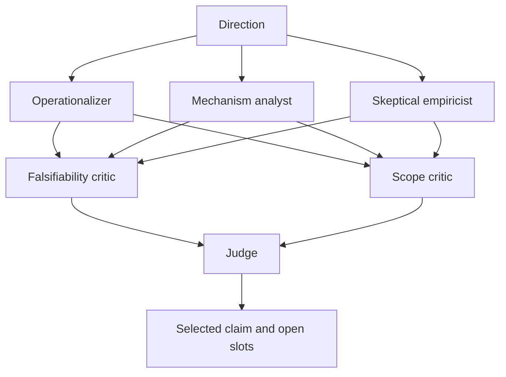

# ClaimScope System Architecture

ClaimScope is an assumption-centric pre-ideation system. Its public contract is a sequence of typed artifacts rather than hidden model reasoning.

## Multi-Agent Arena

The three proposer calls run concurrently. Critics receive only public structured candidates. The judge receives candidates and public rubric scores, then returns the selected candidate, final claim, falsification test, and unresolved ambiguities. When a provider fails or returns malformed JSON, the arena emits a sanitized degraded event and uses a deterministic fallback.

## Module Contracts

| Module | Input | Output | Responsibility |
|---|---|---|---|
| `core_claim` | direction, optional LLM client | `CoreClaimResult` | candidate generation, critique, judging, fallback |
| `planner` | direction | `ClaimPlan` | claim variants, assumptions, four query types |
| `retrievers` | query, limit | `Paper[]` | BM25, TF-IDF, cached dense retrieval, rank fusion, public APIs |
| `evidence` | claim, evidence text | public relation label | support, contradiction, limitation, null-result, abstention |
| `pipeline` | direction, planner, retriever | `AnalysisReport` | evidence mapping, status, negatives, opportunities |
| `models` | typed fields | JSON/Markdown-safe artifacts | provenance, validation, serialization |
| `service` | JSON-compatible request | JSON-compatible response | stable boundary for UI, CLI, and MCP |
| `mcp_server` | MCP tool call | five structured tools | editor and agent integration |
| `app.py` | user controls | Streamlit workflow | consent, trace, evidence, export, feedback |

## Evidence Semantics

`support`, `contradict`, `limitation`, and `null_result` are heuristic abstract-match signals. A retrieval miss remains `unknown`; a limitation is not treated as direct disproof. Every evidence item carries source, URL or external identifier when available, query kind, and snippet offset. Synthetic fixtures are visibly marked and must not be cited as scientific evidence.

Retrieval and adjudication are independent stages. Lexical retrieval is always
available; optional TF-IDF and pretrained E5 indexes improve recall without an
agent call. Dense corpus embeddings are fingerprinted and cached locally.
Evidence classifiers receive retrieved text only, expose public labels rather
than private reasoning, and may abstain. See [External Evaluation](external-evaluation.md)
for stage-specific measurements and boundaries.

## Security And Privacy

Keys are accepted only through environment variables or a password-type in-memory field. The UI requires explicit consent before sending a research direction to an LLM provider or search queries to public academic APIs. Public traces never expose prompts, provider bodies, credentials, or private chain-of-thought.
