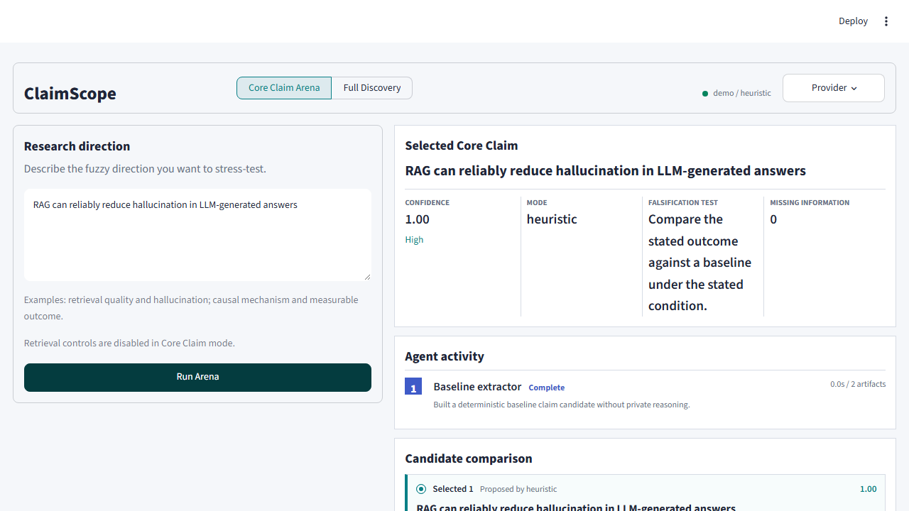

# ClaimScope：面向科研想法生成前的主张、假设与负面证据发现智能体

自然语言处理课程大作业实验报告

姓名：________　学号：________　班级：________

项目仓库：https://github.com/yueqian-coder/multi

## 摘要

科研工具通常从“搜索关键词”或“回答问题”开始，但研究者提出新想法之前更需要知道：方向中的核心说法是什么，哪些隐含假设已经获得证据，哪些仍然悬而未决，哪些负结果和边界条件值得绕开。本文设计并实现 ClaimScope，一个面向 idea 产生前阶段的 assumption-centric 多智能体系统。系统把模糊研究方向依次转换为可证伪核心主张、主张变体、隐含假设、四类证据查询、可追溯证据卡片以及有边界的实验机会点。核心主张模块在 LLM 模式下采用三个 proposer、两个 critic 和一个 judge 的对抗式结构；外部模型不可用时自动降级到透明、确定性的启发式基线。系统同时提供 Streamlit Web 界面、命令行、Markdown 导出和五个 MCP 工具。最终在 27 个跨领域内部 ClaimBench 样例上得到 70.09/100 的启发式回归分数，并通过 96 项自动化测试。该分数只反映结构完整性与回归稳定性，不代表科学真实性。

关键词：科研智能体；多智能体；科学主张验证；负面证据；MCP；检索增强生成

## 1 背景与意义

从模糊方向到可执行研究问题之间存在一个常被忽略的中间层。研究者可能说“RAG 能减少幻觉”，但这句话没有说明比较基线、数据集、评价指标、适用边界与失败条件。直接搜索会带来大量相关论文，却不一定告诉用户：主张由哪些可检验假设组成，某篇论文究竟支持、限制还是直接反驳哪一项假设。

ClaimScope 将任务定义为“idea 产生之前的研究空间校准”。它不是论文库问答，也不替代系统综述；它的目标是把模糊方向转化为可以被验证、被反驳、被缩小范围的公开结构化产物。与一般 RAG 问答相比，本系统的差异在于以 assumption ledger 为中心组织证据，并主动检索 contradiction、limitation 与 null result，而不是只寻找支持材料。

相关工作为本系统提供了三个基础。RAG 说明外部检索可参与知识密集型生成；ReAct 说明语言模型可以交替执行推理与工具动作；SciFact 把科学主张验证形式化为证据检索及支持/反驳判断。PaperQA2 进一步显示语言智能体可以执行真实文献检索、综合与矛盾发现。ClaimScope 不与这些系统竞争完整答案质量，而是聚焦它们之前的“主张操作化与假设审计”缺口。

## 2 需求分析与目标

系统需满足六项功能目标：第一，输入可以是任意领域的模糊研究方向；第二，输出核心主张必须显式包含机制、目标、效果和可证伪测试；第三，把主张拆为可单独核验的隐含假设；第四，为每项假设生成支持、反驳、限制和零结果四类查询；第五，证据必须带来源并把 unknown 与 unsupported 区分；第六，最终机会点必须足够小，可转化为含数据集、基线和指标的实验。

非功能目标包括：无密钥也能复现演示；外部服务失败时可降级；不公开私有思维链；不记录 API 密钥；Web、CLI 和 MCP 共用同一服务边界；自动化测试覆盖正常、异常、降级与安装态场景。

## 3 系统设计

### 3.1 总体工作流


完整流程为 Research Direction → Core Claim → Claim Variants / Boundary Conditions → Hidden Assumptions → Evidence Queries → Evidence Cards → Idea Opportunities。每一步都生成 typed artifact，并记录角色、状态、耗时、公开摘要、产物数量与结构分数。Trace 展示的是可审计事件，而不是模型的私有 chain-of-thought。

### 3.2 核心主张多智能体竞技场


三个 proposer 并行工作：Operationalizer 把方向变成变量、比较组和指标；Mechanism Analyst 明确机制、目标与边界；Skeptical Empiricist 提出最容易被不利结果证伪的窄主张。随后 Falsifiability Critic 与 Scope Critic 按 specificity、falsifiability、mechanism、scope、measurability、risk awareness 六维评分并提出公开修订。Judge 只读取结构化候选和批评，返回候选编号、最终主张、证伪实验和未解决歧义。

LLM 层使用最小 OpenAI-compatible chat client。模型和端点由环境变量或 UI 会话字段配置；本轮真实端点检测到 GPT-5 系列模型，因此客户端进行了一项参数适配尝试：对模型名以 GPT-5 开头的请求不发送非默认 temperature，以减少常见 request-shape 错误。这不等同于已经验证全部 GPT-5 接口能力。若请求超时、HTTP 失败或返回 JSON 形状错误，失败信息会被脱敏，系统转入确定性基线而不中断工作流。

### 3.3 假设与证据链

Planner 生成原始主张、边界变体和失败变体，并拆出四类通用假设：目标设置中的效果真实、所需证据质量足够、评价指标有效、效果可跨数据集或领域泛化。每项假设都有 support、contradict、limitation、null_result 四条查询。Retriever 支持离线 fixture、arXiv 和 Semantic Scholar，并按外部 ID 或标题去重。

Pipeline 把摘要句子映射到假设，保留 snippet offset 和 query kind。保守判定规则包括：未检索到材料时状态为 unknown；只出现 limitation 不等于 disproof；中性提及不计为负面证据；支持和反向信号并存时为 mixed。Negative Evidence Miner 专门抽取 failure mode、limitation 和 negative result，再由 Opportunity Builder 生成 assumption gap 或 negative-evidence experiment slot。

### 3.4 模块与接口

| 模块 | 主要输入 | 主要输出 | 功能 |
|---|---|---|---|
| core_claim | direction, LLM client | CoreClaimResult | 多角色候选、批评、裁决与降级 |
| planner | research direction | ClaimPlan | 主张变体、假设和四类查询 |
| retrievers | query, limit | Paper list | 离线与在线检索、去重、告警 |
| pipeline | planner, retriever | AnalysisReport | 证据映射、负面证据、机会点 |
| models | typed fields | JSON / Markdown | 数据约束、溯源与序列化 |
| service | JSON-compatible args | dict | Web、CLI、MCP 统一边界 |
| mcp_server | tool call | structured payload | 五个可组合科研工具 |
| app.py | user input | interactive workflow | 同意门、Trace、导出与反馈 |

五个 MCP 工具分别为 extract_core_claim、analyze_research_direction、build_evidence_queries、evaluate_claim_benchmark 和 get_demo_report。它们使 ClaimScope 可以嵌入支持 MCP 的编辑器或上层智能体，而不需要复制 UI 逻辑。

## 4 实现过程记录

第一阶段实现最小 pipeline，验证“主张→假设→证据→机会点”数据结构是否连通。第二阶段把核心主张独立为可单测模块，并加入缺失槽位、结构得分和证伪测试。第三阶段实现三 proposer、两 critic、一 judge 的竞技场，限定并发数为三，加入 JSON schema 校验和 weighted fallback。第四阶段增加证据保守语义，修正“检索不到即反驳”和“限制即否证”两类危险错误。第五阶段增加 Web 双模式、公开 Trace、下载反馈、隐私同意门和移动端适配。第六阶段建立 ClaimBench、MCP、wheel clean-install 与 CI 矩阵。

最后验收时，直接使用机器全局 Python 得到 86 passed、8 failed。分析发现失败来自该解释器没有安装项目、MCP extras 和 console scripts，而非业务逻辑回归。随后创建隔离 `.venv`，执行 `pip install -e ".[web,mcp,dev]"`，在同一解释器中全部 96 项测试通过。该过程说明安装态测试必须在声明的依赖环境中运行，也促使最终文档提供一条完整安装命令。

真实 API 冒烟测试中，模型列表接口可正常返回 GPT-5 系列模型，但 chat completions 临时返回 HTTP 503。系统没有泄露 provider body 或密钥，而是记录 degraded 公共事件并回退到启发式结果。这个失败样例没有被包装成“LLM 成功”，而是作为外部依赖、可恢复性与实验可复现性的真实限制。

## 5 实验设计

### 5.1 实验问题

RQ1：启发式核心主张抽取能否在不同领域保持基本结构完整性？RQ2：异常输入、检索失败和外部模型失败时，系统能否继续返回可解释产物？RQ3：Web、CLI、MCP 与安装后的 wheel 是否共享一致行为？RQ4：系统是否明确区分合成演示数据、摘要级信号与科学结论？

### 5.2 数据与指标

ClaimBench 包含 27 个内部构造样例，覆盖 9 个领域，每个领域 3 个方向。评分由 slot coverage、declarative form、specificity、comparison language、measurable outcome、boundary condition、falsifiability、required concept coverage 与 overclaim penalty 组成。报告总分为 0 至 100。该基准用途是版本回归和错误定位，不是人工标注的科学有效性基准。

自动化测试分为 core claim、pipeline、retriever、benchmark、UI contract、repository health 和 MCP stdio 七类。额外验收包含 Python compileall、wheel 构建、仓库外 clean install、CLI、Streamlit health、MCP initialize/list_tools 与密钥扫描。

### 5.3 结果

| 指标 | 最终结果 | 解释 |
|---|---:|---|
| 自动化测试 | 96 passed | 隔离环境，包含安装态与 MCP 测试 |
| ClaimBench | 27 cases | 9 个领域，每领域 3 个样例 |
| 启发式均分 | 70.09 / 100 | 结构回归信号 |
| MCP 工具 | 5 | 均可通过 stdio 列出 |
| 多智能体角色 | 6 | 3 proposer + 2 critic + 1 judge |
| 工作流阶段 | 7 | 从方向到机会点 |
| UI 验证视口 | 2 | 1280×720 与 390×844 |

典型输入为“RAG can reliably reduce hallucination in LLM-generated answers”。启发式抽取识别出机制、目标和预期效果，同时指出 comparison baseline、evaluation metric、boundary conditions 三个未填槽位，结构置信度为 0.50。完整离线流程产生 4 个假设、四方向查询、证据矩阵、负面证据和可执行机会点。界面明确显示 “Synthetic fixture papers are demo data, not research evidence”。



系统在故障路径上也有可验证行为：不相关主张不会错误绑定 fixture；retrieval miss 保持 unknown；neutral mention 不会转成 negative evidence；单个 retriever 失败会变成脱敏 warning；LLM proposer、critic 或 judge 失败时会保留其他公开产物并标记 degraded。

## 6 结果分析与反思

从课程评分角度，本项目的创新点不是“再做一个论文问答”，而是把文献探索的组织单位从 paper 或 question 变为 assumption。主动寻找负结果和限制条件可以减少 confirmation bias，机会点也由明确 gap 推导，而不是让模型凭空生成“看起来新颖”的 idea。MCP 工具进一步把流程变成可组合科研基础设施。

当前结果仍有四类限制。第一，ClaimBench 是内部构造且由规则评分，70.09 不能说明输出真实或有科研价值；下一步应由多名研究者标注可证伪性、边界清晰度和机会价值，并报告一致性。第二，离线论文为 synthetic fixtures，只用于界面和数据链演示。第三，在线检索以摘要和 snippet 为主，无法检查全文方法、统计显著性或复现实验。第四，LLM 模式依赖外部 provider，存在配额、模型参数兼容、超时与非确定性问题。

后续优化应优先加入带许可证约束的全文连接器、人工标注的 ClaimBench、single-LLM 与 multi-agent 的受控消融、调用成本和延迟统计、跨模型复测、引用句与 PDF 页码对齐，以及真实研究者 longitudinal study。系统输出应始终定位为“研究空间导航信号”，而非自动科学裁决。

## 7 总结

ClaimScope 完成了一个可运行、可降级、可追溯的科研前置智能体系统。它把模糊方向逐步转成可证伪主张、隐藏假设、对抗查询、证据卡片、负面结果和有边界的实验机会；同时通过 Web、CLI、Markdown 和 MCP 暴露统一能力。最终 96 项测试、27 案例回归基准和安装态验收说明工程链路完整。更重要的是，系统明确暴露未知项、合成数据与摘要级证据的限制，避免把结构评分误当成科学真实性。项目下一阶段的核心不是增加更多生成文本，而是建立更可靠的人类标注、全文证据与真实科研使用评估。

## 参考文献

[1] Lewis P, Perez E, Piktus A, et al. Retrieval-Augmented Generation for Knowledge-Intensive NLP Tasks. NeurIPS, 2020. https://arxiv.org/abs/2005.11401

[2] Yao S, Zhao J, Yu D, et al. ReAct: Synergizing Reasoning and Acting in Language Models. ICLR, 2023. https://arxiv.org/abs/2210.03629

[3] Wadden D, Lin S, Lo K, et al. Fact or Fiction: Verifying Scientific Claims. EMNLP, 2020. https://arxiv.org/abs/2004.14974

[4] Skarlinski M D, Cox S, Laurent J M, et al. Language agents achieve superhuman synthesis of scientific knowledge. 2024. https://arxiv.org/abs/2409.13740

## 附录 A 复现命令

```text
python -m venv .venv
.venv\\Scripts\\python -m pip install -e ".[web,mcp,dev]"
.venv\\Scripts\\python -m pytest -q
.venv\\Scripts\\python -m claimscope.cli benchmark --engine heuristic
.venv\\Scripts\\streamlit run app.py
```

## 附录 B 提交检查

报告和视频文件名需替换姓名、学号；视频不超过 1 分钟并含语音；提交前不得在画面、报告、Git 历史或附件中出现 API key；离线 fixture 必须标记为演示数据。
